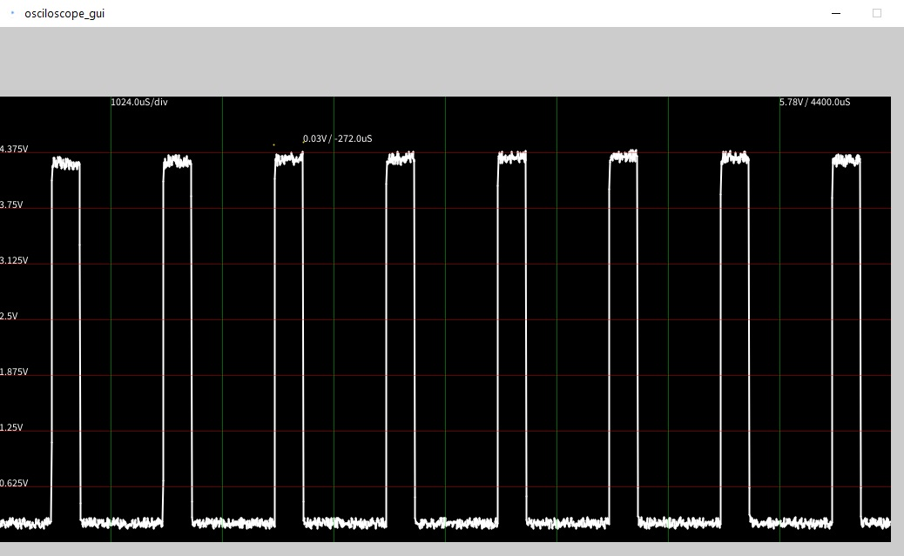
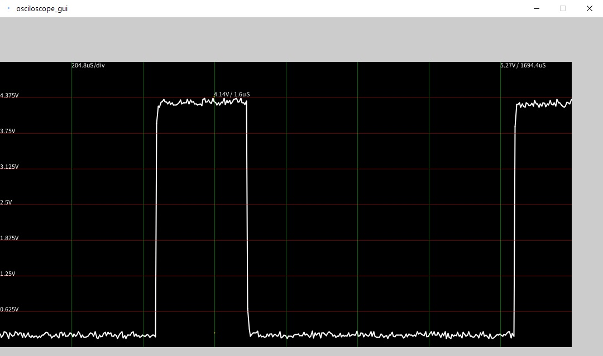

# Arduino-Leonardo-Oscilloscope
Yet another Arduino Based oscilloscope

## Installation
Upload the Arduino code to your arduino leonardo  
Install processing and run the processing code  
*you might need to modify oscilloscope_gui.pde:20 : Serial.list()[X] to your Arduino serial port*

## Usage
In the processing scope window press:
* T for single trigger
* O for triggering once on edge (r/f)
* R for setting rising edge threshold
* F for setting falling edge threshold
* C for continuous triggering on edge
* S to stop continuous trigger
* +-/* for zooming in/out on voltage/time axis

## Performance
20 μs/sample  
1024 samples/trigger  
~8bit resolution  

## Arduino zero code
The arduino zero(SAMD21) improved code  
4 μs/sample  
2048 samples/trigger  
~10bit resolution  

## Demo
Samd21 measuring a 5v 976Hz PWM signal trough a 1/2 voltage divider  

